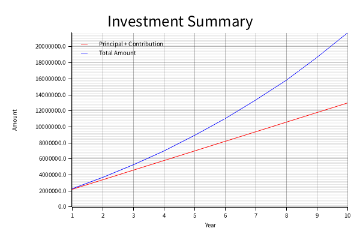

[](https://github.com/nao1215/cic/actions/workflows/build.yml)
[](https://github.com/nao1215/cic/actions/workflows/test.yml)

# cic - compound interest calculator
The cic command calculates compound interest. The results of the calculation are output as either a bar graph (`plot.png`) or in JSON format. The cic command has a mode for starting as a server.

The cis calculates the total final amount of the investment based on the input values for the principal, monthly contribution, annual interest rate, and the number of years of contribution.

## Build
```bash
$ cargo build --release
```

## Install
```bash
$ cargo install --path .
```

## Usage
```bash
$ cic --help
cis - Calculates Compound Interest.
Output the results of compound interest calculations as either a line graph image or JSON.

Usage: cic [OPTIONS] [COMMAND]

Commands:
  server  Starts the server mode
  help    Print this message or the help of the given subcommand(s)

Options:
  -p, --principal <PRINCIPAL>        The principal at the time you started investing. Defaults to 0
  -c, --contribution <CONTRIBUTION>  The monthly contribution amount. Defaults to 1
  -r, --rate <RATE>                  The annual interest rate (in %). Defaults to 5
  -y, --years <YEARS>                The number of years for contributions. Defaults to 5
  -j, --json                         Output as JSON. Defaults to false
  -h, --help                         Print help
```

## Example
### Output plot.png

```bash
$ cic --principal 1000000 --contribution 100000 --rate 10 --years 10
```



### Output json

```shell
$ ./target/debug/cic --principal 1000000 --contribution 100000 --rate 10 --years 5 --json
[
  {
    "year": 1,
    "principal": 1000000.0,
    "annual_contribution": 1200000.0,
    "total_contribution": 1200000.0,
    "annual_interest": 100000.0,
    "total_interest": 100000.0,
    "total_amount": 2300000.0
  },
  {
    "year": 2,
    "principal": 1000000.0,
    "annual_contribution": 1200000.0,
    "total_contribution": 2400000.0,
    "annual_interest": 230000.0,
    "total_interest": 330000.0,
    "total_amount": 3730000.0
  },
  {
    "year": 3,
    "principal": 1000000.0,
    "annual_contribution": 1200000.0,
    "total_contribution": 3600000.0,
    "annual_interest": 373000.0,
    "total_interest": 703000.0,
    "total_amount": 5303000.0
  },
  {
    "year": 4,
    "principal": 1000000.0,
    "annual_contribution": 1200000.0,
    "total_contribution": 4800000.0,
    "annual_interest": 530300.0,
    "total_interest": 1233300.0,
    "total_amount": 7033300.0
  },
  {
    "year": 5,
    "principal": 1000000.0,
    "annual_contribution": 1200000.0,
    "total_contribution": 6000000.0,
    "annual_interest": 703330.0,
    "total_interest": 1936630.0,
    "total_amount": 8936630.0
  }
]
```

### Sever mode

```shell
$ cic server
Starting server, port: 8080
POST /compound-interests
```

```shell
$ curl -X POST "http://localhost:8080/compound-interests" \
  -H "Content-Type: application/json" \
  -d '{"principal": 1000000, "contribution": 100000, "rate": 10, "years": 2}' | jq .
[
  {
    "annual_contribution": 1200000.0,
    "annual_interest": 100000.0,
    "principal": 1000000.0,
    "total_amount": 2300000.0,
    "total_contribution": 1200000.0,
    "total_interest": 100000.0,
    "year": 1
  },
  {
    "annual_contribution": 1200000.0,
    "annual_interest": 230000.0,
    "principal": 1000000.0,
    "total_amount": 3730000.0,
    "total_contribution": 2400000.0,
    "total_interest": 330000.0,
    "year": 2
  }
]
```


## License
MIT

## Contributing
First off, thanks for taking the time to contribute! ❤️  See [CONTRIBUTING.md](./CONTRIBUTING.md) for more information.
Contributions are not only related to development. For example, GitHub Star motivates me to develop!

[](https://star-history.com/#nao1215/cic&Date)

## Side note

The cic command is my first project in Rust. I am using it to learn how to write and structure projects in Rust.

### Why did I choose the theme of compound interest?

In Japan, the small amount investment tax exemption system (NISA) started gaining traction in 2024. I was fortunate enough to get involved in a NISA app at work.

This led me to develop an interest in investments. So, it's not surprising that I chose compound interest as my theme.
